Data Visualization
================
Stephen Yuan
10/4/2021

## Load the weather

``` r
weather_df = 
  rnoaa::meteo_pull_monitors(
    c("USW00094728", "USC00519397", "USS0023B17S"),
    var = c("PRCP", "TMIN", "TMAX"), 
    date_min = "2017-01-01",
    date_max = "2017-12-31") %>%
  mutate(
    name = recode(
      id, 
      USW00094728 = "CentralPark_NY", 
      USC00519397 = "Waikiki_HA",
      USS0023B17S = "Waterhole_WA"),
    tmin = tmin / 10, # 最低温
    tmax = tmax / 10) %>% # 最高温
  select(name, id, everything())
```

    ## Registered S3 method overwritten by 'hoardr':
    ##   method           from
    ##   print.cache_info httr

    ## using cached file: ~/Library/Caches/R/noaa_ghcnd/USW00094728.dly

    ## date created (size, mb): 2021-10-05 10:29:14 (7.602)

    ## file min/max dates: 1869-01-01 / 2021-10-31

    ## using cached file: ~/Library/Caches/R/noaa_ghcnd/USC00519397.dly

    ## date created (size, mb): 2021-10-05 10:29:17 (1.697)

    ## file min/max dates: 1965-01-01 / 2020-02-29

    ## using cached file: ~/Library/Caches/R/noaa_ghcnd/USS0023B17S.dly

    ## date created (size, mb): 2021-10-05 10:29:18 (0.912)

    ## file min/max dates: 1999-09-01 / 2021-09-30

## Scatterplots!!

Create my first scatterplot ever.

``` r
ggplot(weather_df, aes(x = tmin, y = tmax)) +
  geom_point()
```

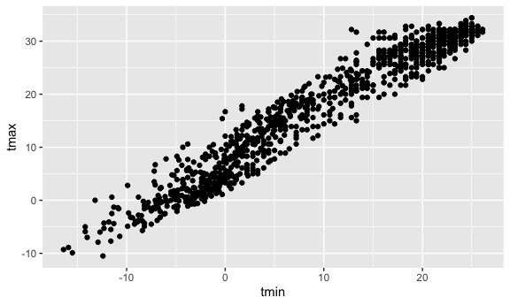

New approach, same plot.

``` r
weather_df %>% 
  ggplot(aes(x = tmin, y = tmax)) +
  geom_point()
```

    ## Warning: Removed 15 rows containing missing values (geom_point).


Save and edit a plot object

``` r
weather_plot = 
  weather_df %>% 
  ggplot(aes(x = tmin, y = tmax))

weather_plot + geom_point()
```

    ## Warning: Removed 15 rows containing missing values (geom_point).


## Advanced scatterplot …

Start with the same ont and make it fancy!

``` r
weather_df %>% 
  ggplot(aes(x = tmin, y = tmax, color = name)) +
  geom_point(alpha = .3) +
  geom_smooth(aes(color = NULL), se = FALSE)
```

    ## `geom_smooth()` using method = 'gam' and formula 'y ~ s(x, bs = "cs")'

    ## Warning: Removed 15 rows containing non-finite values (stat_smooth).

    ## Warning: Removed 15 rows containing missing values (geom_point).


What about the `aes` placement…

``` r
weather_df %>% 
  ggplot(aes(x = tmin, y = tmax)) +
  geom_point(aes(color = name)) + 
  geom_smooth()
```

    ## `geom_smooth()` using method = 'gam' and formula 'y ~ s(x, bs = "cs")'

    ## Warning: Removed 15 rows containing non-finite values (stat_smooth).

    ## Warning: Removed 15 rows containing missing values (geom_point).


Lets facet some things!!

``` r
weather_df %>% 
  ggplot(aes(x = tmin, y = tmax)) +
  geom_point(alpha = .2) +
  geom_smooth(se = FALSE, size = 2) +
  facet_grid(. ~ name) #按name分图
```

    ## `geom_smooth()` using method = 'loess' and formula 'y ~ x'

    ## Warning: Removed 15 rows containing non-finite values (stat_smooth).

    ## Warning: Removed 15 rows containing missing values (geom_point).

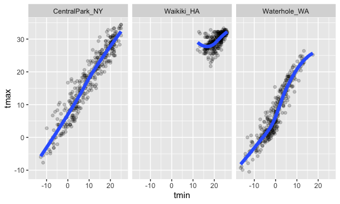

Lets combine some elements and try a new plot.

``` r
weather_df %>% 
  ggplot(aes(x = date, y = tmax, color = name)) +
  geom_point(alpha = .5) +
  geom_smooth(se = FALSE) +
  facet_grid(. ~ name)
```

    ## `geom_smooth()` using method = 'loess' and formula 'y ~ x'

    ## Warning: Removed 3 rows containing non-finite values (stat_smooth).

    ## Warning: Removed 3 rows containing missing values (geom_point).

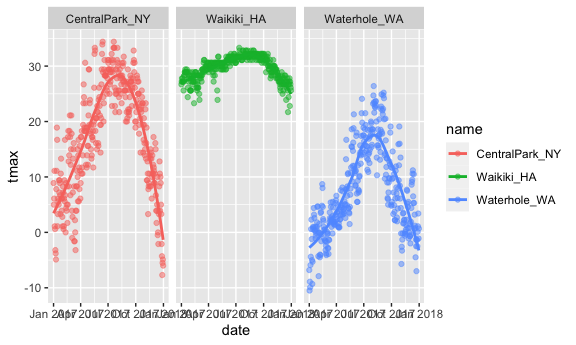

## Some small notes

How many geoms have to exist?

You can have whatever geoms you want.

``` r
weather_df %>% 
  ggplot(aes(x = tmin, y = tmax, color = name)) +
  geom_smooth(se = FALSE)
```

    ## `geom_smooth()` using method = 'loess' and formula 'y ~ x'

    ## Warning: Removed 15 rows containing non-finite values (stat_smooth).

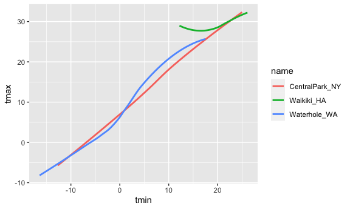

2D picture

``` r
weather_df %>% 
  ggplot(aes(x = tmin, y = tmax, color = name)) +
  geom_bin_2d() # 2D图
```

    ## Warning: Removed 15 rows containing non-finite values (stat_bin2d).


You can use a neat geom!

``` r
weather_df %>% 
  ggplot(aes(x = tmin, y = tmax)) +
  geom_density2d() +
  geom_point(alpha = .3)
```

    ## Warning: Removed 15 rows containing non-finite values (stat_density2d).

    ## Warning: Removed 15 rows containing missing values (geom_point).

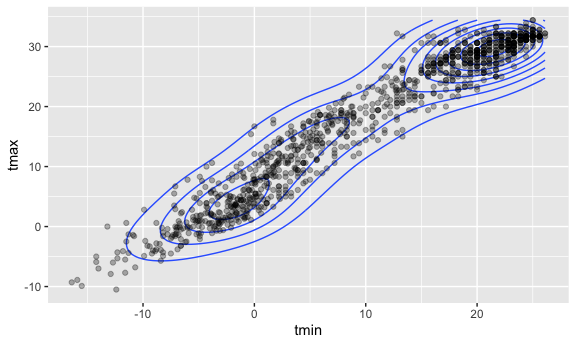

## Use data manipulation

``` r
weather_df %>% 
  filter(name == "CentralPark_NY") %>% 
  mutate(tmax = tmax*(9 / 5) + 32,
         tmin = tmin*(9 / 5) + 32)
```

    ## # A tibble: 365 × 6
    ##    name           id          date        prcp  tmax  tmin
    ##    <chr>          <chr>       <date>     <dbl> <dbl> <dbl>
    ##  1 CentralPark_NY USW00094728 2017-01-01     0  48.0  39.9
    ##  2 CentralPark_NY USW00094728 2017-01-02    53  41    37.0
    ##  3 CentralPark_NY USW00094728 2017-01-03   147  43.0  39.0
    ##  4 CentralPark_NY USW00094728 2017-01-04     0  52.0  34.0
    ##  5 CentralPark_NY USW00094728 2017-01-05     0  34.0  27.1
    ##  6 CentralPark_NY USW00094728 2017-01-06    13  33.1  25.2
    ##  7 CentralPark_NY USW00094728 2017-01-07    81  26.2  20.1
    ##  8 CentralPark_NY USW00094728 2017-01-08     0  25.2  16.2
    ##  9 CentralPark_NY USW00094728 2017-01-09     0  23.2  14.2
    ## 10 CentralPark_NY USW00094728 2017-01-10     0  46.0  21.2
    ## # … with 355 more rows

## Univeriate plots

Histograms are really great.

``` r
weather_df %>% 
  ggplot(aes(x = tmin)) +
  geom_histogram()
```

    ## `stat_bin()` using `bins = 30`. Pick better value with `binwidth`.

    ## Warning: Removed 15 rows containing non-finite values (stat_bin).

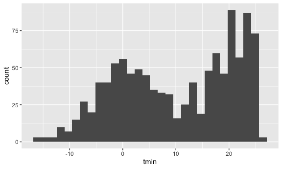

Can we add color …

``` r
weather_df %>% 
  ggplot(aes(x = tmin, fill = name)) +
  geom_histogram() +
  facet_grid(. ~ name)
```

    ## `stat_bin()` using `bins = 30`. Pick better value with `binwidth`.

    ## Warning: Removed 15 rows containing non-finite values (stat_bin).

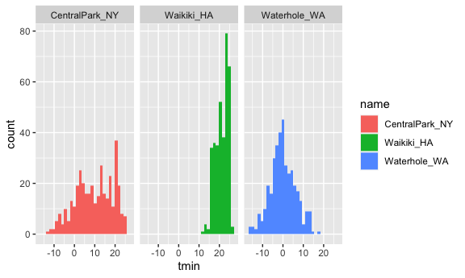

Lets try a new geometry

``` r
weather_df %>% 
  ggplot(aes(x = tmin, fill = name)) +
  geom_density(alpha = .1) # alpha = 颜色深度, 先配合分类
```

    ## Warning: Removed 15 rows containing non-finite values (stat_density).

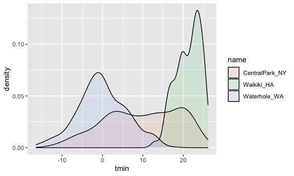

What about the plots ??

``` r
weather_df %>% 
  ggplot(aes(x = name, y = tmin, fill = name)) + 
  geom_boxplot(alpah = .3)
```

    ## Warning: Ignoring unknown parameters: alpah

    ## Warning: Removed 15 rows containing non-finite values (stat_boxplot).

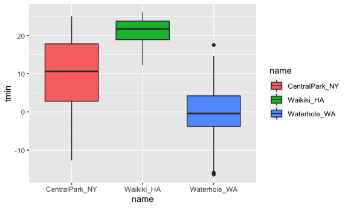

Trendy plots .. violin box

``` r
weather_df %>% 
  ggplot(aes(x = name, y = tmin, fill = name)) +
  geom_violin(alpha = .5) +
  stat_summary()
```

    ## Warning: Removed 15 rows containing non-finite values (stat_ydensity).

    ## Warning: Removed 15 rows containing non-finite values (stat_summary).

    ## No summary function supplied, defaulting to `mean_se()`

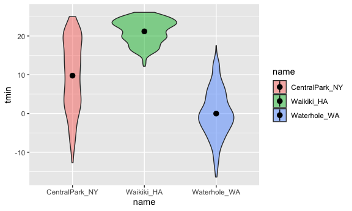

Ridge plots – the most popular plot of 2017

``` r
weather_df %>% 
  ggplot(aes(x = tmin, y = name)) +
  geom_density_ridges(alpha = .8, scale = .8)
```

    ## Picking joint bandwidth of 1.67

    ## Warning: Removed 15 rows containing non-finite values (stat_density_ridges).

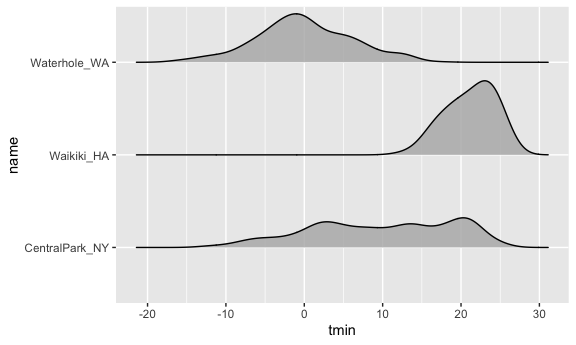

## Save and Embed

Lets save a scatterplot.

``` r
weather_plot = 
  weather_df %>% 
  ggplot(aes(x = tmin, y = tmax, color = name)) +
  geom_point(alpha = .5)

ggsave("./weather_plot.pdf", weather_plot, width = 8, height = 5)
```

    ## Warning: Removed 15 rows containing missing values (geom_point).

What about embedding..

``` r
weather_plot
```

    ## Warning: Removed 15 rows containing missing values (geom_point).

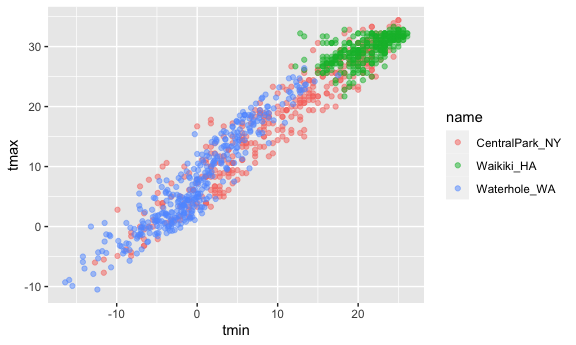

``` r
weather_plot
```

    ## Warning: Removed 15 rows containing missing values (geom_point).

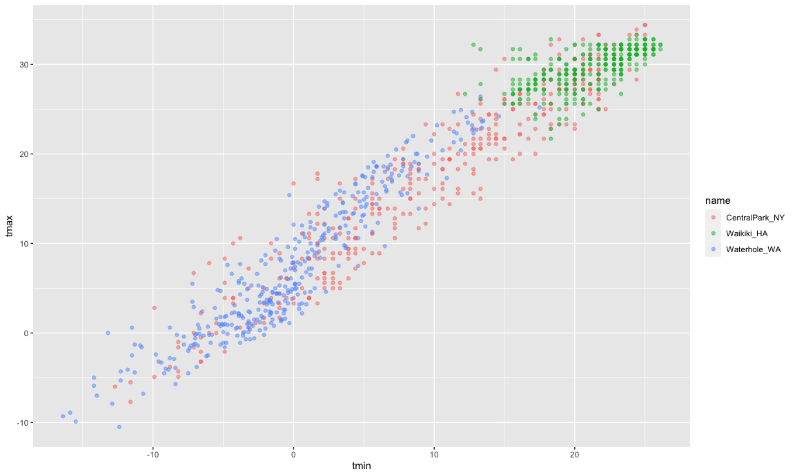
