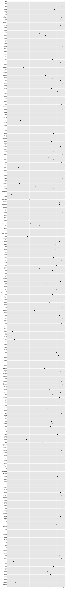

p8105\_hw02\_zy2392
================
Stephen Yuan
10/3/2021

    ## ── Attaching packages ─────────────────────────────────────── tidyverse 1.3.1 ──

    ## ✓ ggplot2 3.3.5     ✓ purrr   0.3.4
    ## ✓ tibble  3.1.4     ✓ dplyr   1.0.7
    ## ✓ tidyr   1.1.3     ✓ stringr 1.4.0
    ## ✓ readr   2.0.1     ✓ forcats 0.5.1

    ## ── Conflicts ────────────────────────────────────────── tidyverse_conflicts() ──
    ## x dplyr::filter() masks stats::filter()
    ## x dplyr::lag()    masks stats::lag()

# Problem 1

## 1. Read in and Clean Mr.Trash Wheel data

Read in Mr.Trash Wheel data.

``` r
raw_trash_wheel_df = read_excel("./hw_data/Trash-Wheel-Collection-Totals-7-2020-2.xlsx", sheet = 'Mr. Trash Wheel', range = 'A2:N535') %>% 
  janitor::clean_names()
```

Clean Mr.Trash Wheel data.

``` r
trash_wheel_df = raw_trash_wheel_df %>% 
                 drop_na('dumpster') %>% 
                 rename(c('hard_plastic' = 'polystyrene')) %>%
                 mutate(sports_balls = round(sports_balls)) 
```

## 2. Read in and Clean precipitation datasets

Read and Clean preciptation data in 2018

``` r
precipitation_2018 = 
  read_excel("./hw_data/Trash-Wheel-Collection-Totals-7-2020-2.xlsx", sheet = '2018 Precipitation', range = 'A2:B14') %>% 
  janitor::clean_names() %>% 
  drop_na(total) %>% 
  mutate(year = 2018) %>% 
  relocate(year, month, total)
```

Read and Clean preciptation data in 2019

``` r
precipitation_2019 = 
  read_excel("./hw_data/Trash-Wheel-Collection-Totals-7-2020-2.xlsx", sheet = '2019 Precipitation', range = 'A2:B14') %>% 
  janitor::clean_names() %>% 
  drop_na(total) %>% # Transfer NaN into 0: mutate_all(~replace(., is.na(.), 0))
  mutate(year = 2019) %>% 
  relocate(year, month, total)
```

Combine precipitation data for 2018 and 2019

``` r
prec_comb = 
  bind_rows(precipitation_2018, precipitation_2019) %>% 
  mutate(month = month.name[as.integer(month)])
```

## 3. Summary

There are 454 observations, 14 features in dataset Mr. Trash Wheel, key
variables include dumpster, month, year, date, weight\_tons,
volume\_cubic\_yards, plastic\_bottles, hard\_plastic, cigarette\_butts,
glass\_bottles, grocery\_bags, chip\_bags, sports\_balls,
homes\_powered.

*dumpster* indicates the id of trash wheel, *month* *year* *date*
indicates time of dumping, *homes powered* indicates how many homes
provided electricity by this project, and the remaining variables
indicate differen types of trash that are collected by the wheel.

The median number of sports balls is 9.

Dataset prec\_comb indicates preciptation in 2018 and 2019, including 24
months in total.

The total preciptation in 2018 is 70.33 inches.

# Problem 2

## 1. Data manipulation for dataset pols-month.csv

Read in and Clean pols-month.csv

``` r
raw_pols_month = read_csv("./hw_data/538_data/pols-month.csv") 
```

    ## Rows: 822 Columns: 9

    ## ── Column specification ────────────────────────────────────────────────────────
    ## Delimiter: ","
    ## dbl  (8): prez_gop, gov_gop, sen_gop, rep_gop, prez_dem, gov_dem, sen_dem, r...
    ## date (1): mon

    ## 
    ## ℹ Use `spec()` to retrieve the full column specification for this data.
    ## ℹ Specify the column types or set `show_col_types = FALSE` to quiet this message.

``` r
pols_month = 
  raw_pols_month %>% 
  janitor::clean_names() %>% 
  separate(., col = mon, into = c('year','month','day'), sep = '-', remove = FALSE) %>% 
  mutate(month = month.name[as.integer(month)]) %>% 
  mutate(president = ifelse(prez_gop == 1, 'gop', ifelse(prez_dem == 1, 'dem', 'others'))) %>%
  subset(., select = -c(prez_dem, prez_gop, day))
```

## 2. Data manipulation for snp.csv

``` r
raw_snp = read_excel("./hw_data/538_data/snp.xlsx")

snp_df = 
  raw_snp %>% 
  janitor::clean_names() %>% 
  separate(col = date, into = c('month','day','year'), sep = '/', remove = FALSE) %>% 
  arrange(year, as.integer(month)) %>% 
  mutate(month = month.name[as.integer(month)]) %>%
  relocate(year, month, day)
```

## 3. Data manipulation for unemployeement.csv

``` r
raw_unemp = read_csv("./hw_data/538_data/unemployment.csv") %>% 
  janitor::clean_names()
```

    ## Rows: 68 Columns: 13

    ## ── Column specification ────────────────────────────────────────────────────────
    ## Delimiter: ","
    ## dbl (13): Year, Jan, Feb, Mar, Apr, May, Jun, Jul, Aug, Sep, Oct, Nov, Dec

    ## 
    ## ℹ Use `spec()` to retrieve the full column specification for this data.
    ## ℹ Specify the column types or set `show_col_types = FALSE` to quiet this message.

``` r
unemp_df = 
  raw_unemp %>% 
  pivot_longer(
    jan:dec,
    names_to = "month",
    values_to = "unemployment_rate"
  )
```

## 4. Merge datasets: pols\_month, snp\_df, unemp\_df

``` r
pols_month = 
  pols_month %>% 
  mutate(month = substr(month,1,3)) %>% 
  rename(., year_1 = year) %>% 
  rename(., month_1 = month)

snp_df = 
  snp_df %>% 
  mutate(month = substr(month,1,3)) %>%
  rename(., month_2 = month) %>% 
  rename(., year_2 = year)

semi_final_data = 
  left_join(pols_month, snp_df, by = c("year_1" = "year_2", "month_1" = "month_2")) %>% 
  mutate(year_1 = as.integer(year_1)) %>% 
  mutate(month_1 = str_to_lower(month_1))

final_data = 
  left_join(semi_final_data, unemp_df, by = c("year_1" = "year", "month_1" = "month"))
```

## 5. Summary

For pols\_month.csv, it contains the comparison of political power
between Democratic party and Republican party for every month.

For snp.csv, it contains closing price of stocks for every month.

For unemployment.csv, it contains the unemployment rate for every month.

For the final dataset, there are 822 observations and 14 features. It
ranges from 1947-01-15 to 2015-06-15, 68 years in total. In addition,
variable *mon* refers to date of event, *gov*, *sen*, *rep* represent
the political comparison between Democratic party and Republican party,
*close* refers to closing price of stock, and *unemployment\_rate*
associats with the unemployment rate on specific day.

# Problem 3

## 1. Read in and Tidy data

``` r
raw_pop_names = 
  read_csv("./hw_data/Popular_Baby_Names.csv") %>% 
  janitor::clean_names()
```

    ## Rows: 19418 Columns: 6

    ## ── Column specification ────────────────────────────────────────────────────────
    ## Delimiter: ","
    ## chr (3): Gender, Ethnicity, Child's First Name
    ## dbl (3): Year of Birth, Count, Rank

    ## 
    ## ℹ Use `spec()` to retrieve the full column specification for this data.
    ## ℹ Specify the column types or set `show_col_types = FALSE` to quiet this message.

``` r
# 'ASIAN AND PACIFIC ISLANDER' and 'ASIAN AND PACI' refer to the same thing
# 'BLACK NON HISPANIC', 'BLACK NON HISP' refer to the same thing
# 'WHITE NON HISPANIC', 'WHITE NON HISP' refer to the same thing
# case structure of childs_first_name changed over time
pop_names = 
  raw_pop_names %>% 
  distinct(year_of_birth, gender, ethnicity, childs_first_name, count, rank) %>% 
  mutate(childs_first_name = str_to_lower(childs_first_name)) %>% 
  mutate(ethnicity = ifelse(ethnicity == 'ASIAN AND PACI', 'ASIAN AND PACIFIC ISLANDER', 
                              ifelse(ethnicity == 'BLACK NON HISP', 'BLACK NON HISPANIC',
                                     ifelse(ethnicity == 'WHITE NON HISP', 'WHITE NON HISPANIC', ethnicity))))
head(pop_names, 10) %>% 
  knitr::kable()
```

| year\_of\_birth | gender | ethnicity                  | childs\_first\_name | count | rank |
|----------------:|:-------|:---------------------------|:--------------------|------:|-----:|
|            2016 | FEMALE | ASIAN AND PACIFIC ISLANDER | olivia              |   172 |    1 |
|            2016 | FEMALE | ASIAN AND PACIFIC ISLANDER | chloe               |   112 |    2 |
|            2016 | FEMALE | ASIAN AND PACIFIC ISLANDER | sophia              |   104 |    3 |
|            2016 | FEMALE | ASIAN AND PACIFIC ISLANDER | emily               |    99 |    4 |
|            2016 | FEMALE | ASIAN AND PACIFIC ISLANDER | emma                |    99 |    4 |
|            2016 | FEMALE | ASIAN AND PACIFIC ISLANDER | mia                 |    79 |    5 |
|            2016 | FEMALE | ASIAN AND PACIFIC ISLANDER | charlotte           |    59 |    6 |
|            2016 | FEMALE | ASIAN AND PACIFIC ISLANDER | sarah               |    57 |    7 |
|            2016 | FEMALE | ASIAN AND PACIFIC ISLANDER | isabella            |    56 |    8 |
|            2016 | FEMALE | ASIAN AND PACIFIC ISLANDER | hannah              |    56 |    8 |

## 2. Find the popularity of specific names

Showing the rank in popularity of the name “Olivia”.

``` r
pop_olivia = 
  pop_names %>% 
  select(-count) %>% 
  filter(gender == 'FEMALE' & childs_first_name == 'olivia') %>% 
  pivot_wider(
    names_from = "year_of_birth",
    values_from = "rank"
  ) %>% 
  select (-gender, -childs_first_name)

pop_olivia %>% 
  knitr::kable()
```

| ethnicity                  | 2016 | 2015 | 2014 | 2013 | 2012 | 2011 |
|:---------------------------|-----:|-----:|-----:|-----:|-----:|-----:|
| ASIAN AND PACIFIC ISLANDER |    1 |    1 |    1 |    3 |    3 |    4 |
| BLACK NON HISPANIC         |    8 |    4 |    8 |    6 |    8 |   10 |
| HISPANIC                   |   13 |   16 |   16 |   22 |   22 |   18 |
| WHITE NON HISPANIC         |    1 |    1 |    1 |    1 |    4 |    2 |

Showing the most popular name among male children over time (by year).

count the number of name of male children by year.

``` r
pop_male_name = 
  pop_names %>% 
  filter(gender == "MALE") %>% 
  group_by(year_of_birth, ethnicity, childs_first_name) %>% 
  summarise(count_name = sum(count)) %>% 
  filter(count_name == max(count_name))
```

    ## `summarise()` has grouped output by 'year_of_birth', 'ethnicity'. You can override using the `.groups` argument.

make table to show most popular male name each year.

``` r
pop_male_name_by_year = 
    pop_male_name %>% 
  select(-count_name) %>% 
  pivot_wider(
    names_from = "year_of_birth",
    values_from = "childs_first_name"
  )

pop_male_name_by_year %>% 
  knitr::kable()
```

| ethnicity                  | 2011    | 2012   | 2013   | 2014   | 2015   | 2016   |
|:---------------------------|:--------|:-------|:-------|:-------|:-------|:-------|
| ASIAN AND PACIFIC ISLANDER | ethan   | ryan   | jayden | jayden | jayden | ethan  |
| BLACK NON HISPANIC         | jayden  | jayden | ethan  | ethan  | noah   | noah   |
| HISPANIC                   | jayden  | jayden | jayden | liam   | liam   | liam   |
| WHITE NON HISPANIC         | michael | joseph | david  | joseph | david  | joseph |

## 3. Scatterplot: the number of children with a name (y) v.s. the rank in popularity of name (x).

``` r
name_rank_plot = 
  pop_names %>% 
  filter(gender == "MALE" & ethnicity == "WHITE NON HISPANIC" & year_of_birth == 2016) %>% 
  mutate(childs_first_name = as.factor(childs_first_name))

ggplot(name_rank_plot, aes(x = rank, y = childs_first_name)) + geom_point()
```

<!-- -->
